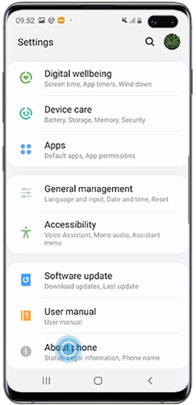
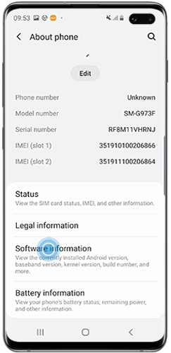
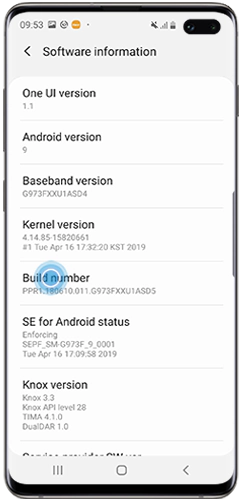
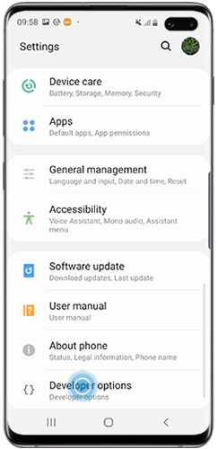
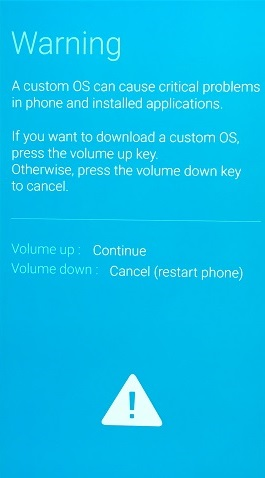
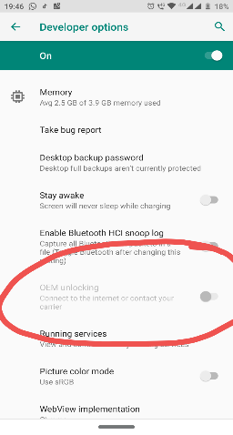
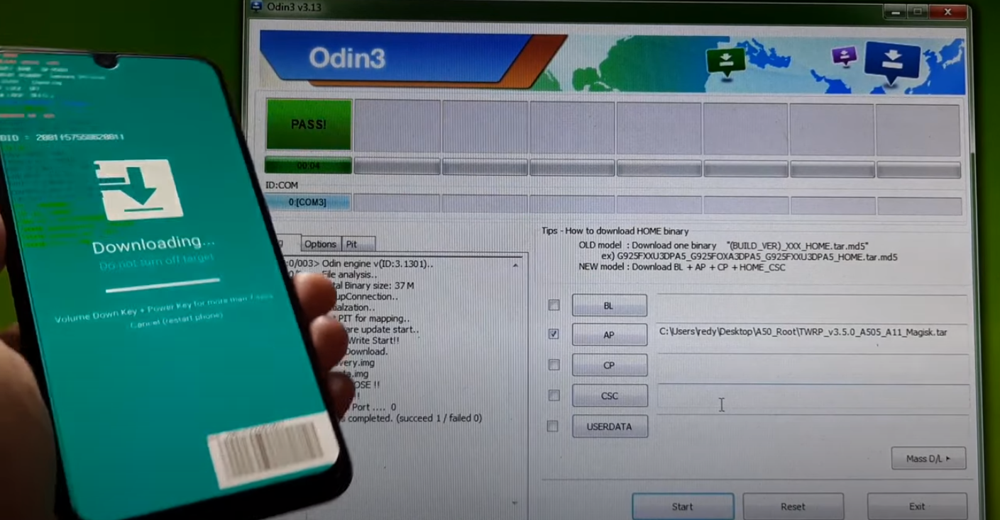
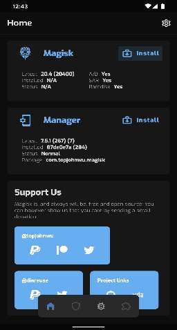

# Samsung Galaxy A50 Cihazları Temiz Bir Şekilde Nasıl Köklendirebiliriz?

Ben 0rbianta. Daha önce 2 yıllık bir Android yazılımı geliştirme deneyimim oldu. Bunun dışında uzun zamandır yazılım ve güvenlik ile ilgileniyorum. Bu rehberde sizlere Samsung Galaxy A50 cihazınızı temiz bir şekilde nasıl köklendireceğinizi göstereceğim.

# Android Hakkında Bilgi
Android işletim sistemi ağır şekilde modifiye edilmiş Linux'dür. Android sistemi açık kaynaklıdır ve Android Open Source Project(AOSP) olarak geçer. Açık kaynaklı olması sebebi ile güvenlik açıklarının bulunması, sistemin modifiye edilmesi, sistemin geliştirilmesi vb. daha kolay bir şekilde gerçekleştirilebilir. Bunun dışında Samsung, Huawei, Sony vb. şirketler Android'i kullanacakları zaman kendi mühendisleri bazı ekleme ve çıkarmalar yapar. Yani şu anda köklemek istediğimiz A50 cihazımızda sade bir Android yoktur. Samsung'un modifiye ettiği bir sistem vardır. Bu köklendirme için engel yaratmaz.

# Neden Köklendirmek İsteyebilirsiniz?
Eğer daha önce Linux deneyiminiz olduysa Linux'ün ne kadar sınırsız bir kullanım alanı sunduğunu biliyorsunuzdur. Androidler de aslında sınırsızdır. Eğer nasıl kullanacağınızı biliyorsanız cihazınızı hem bilgisayar hem de Android olarak bile kullanabilirsiniz. Böylece sadece yerinizde oturup cihazınızı modifiye ederek yeni bir bilgisayar almış gibi olursunuz. Cebinizde bu bilgisayarı taşıyabilirsiniz. İsterseniz cihazınızın ses ayarlarını modifiye edip Viper4Android gibi bir yazılım ile müzikleride duymadığınız detayları bile duyabilirsiniz. İsterseniz sistemin dış görünümünü değiştirebilir ve daha havalı bir görünüm elde edebilirsiniz. Yazılımdan anlıyorsanız isterseniz kendi kök yazılımlarınızı geliştirerek sistemin çalışma şekline müdahale edebilir, reklamları kaldırabilirsiniz. Ben şahsen asıl sorulması gereken sorunun insanların nasıl köksüz cihazlar kullanabiliyor olması olduğunu düşünüyorum. Sınırları kırın gitsin!

# A50 Cihazınızı Nasıl Köklendirebilirsiniz?
Genelde cihazını köklendirmek isteyen çoğunluk kolay yolu seçer ve Kingroot gibi yazılımlarla tek bir tıklama ile cihazlarını köklendirirler. Ancak bu tarz yöntemler bana sorarsanız hiç temiz değildir. Kingroot'un casus yazılım olduğu hakkında söylentiler vardır ve çoğu kişi internette Kingroot ile köklendirme sonrası 3-5 ay sonra cihazlarının bozulduğunu rapor ediyorlar. Bu onların kökü yanlış kullanmış olmasından da kaynaklanmış olabilir ama bence Kingroot kullanmak çok yanlış bir hamle. Bir işi yapıyorsanız temiz ve en iyi şekilde hatasız yapmaya çalışın.

Hadi köklendirmeye başlayalım!
Benim yapacağım yoldan A50 cihazınızı köklendirmek için tahmin edebileceğiniz üzere ilk önce sisteme kuracağınız bazı dosyalara ihtiyacınız var. Bu dosyaları doğru seçmeniz çok önemli. İnternette bulduğunuz herhangi bir dosyayı kullanmanız cihazınızı bir daha kullanılamaz hale getirebilir. Farklı modellerin farklı modifiye dosyaları vardır. Üstelik bu işlem için bizim birden fazla dosyaya ihtiyacımız var. Bunlardan birincisi TWRP kurtarma modunun SM-A505F için yapılmış sürümüdür. Ne yazık ki TWRP orjinal olarak A50 cihazları desteklemez. Bu sebeple üçüncü partilerce yapılmış TWRP görüntü dosyalarını kullanacağız ve bunları seçerken de güvenilir, mümkünse açık kaynaklı, cihaza uygun olduğundan emin olmalıyız. Bunun dışında bu işlem sonrasında eğer modifiye edilmiş bir rom kurmazsanız Samsung'un orjinal rom'u sizi birçok şeyden yoksun bırakacaktır. Bu rehberde Fresh Rom kuruyor olacağız. Fresh Rom'un da cihazımıza uygun olan dosyalarına ihtiyacınız var. Bunun dışında cihaza görüntü dosyasını kurarken ihtiyaç duyacağımız yazılımın adı da ODIN. ODIN'in hangi sürümünü seçtiğiniz de önemli. Yanlış sürüm istenmeyen sonuç yaratabilir. Unuymayın, en ufak bir hamle cihazınızı kullanılamaz hale getirebilir. Temiz, düzenli ve bilgi temelli çalışma ise çözümdür.

    Yani işlem için gereken dosyalar:
    1) Cihazınıza uygun TWRP görüntüsü.
    2) Cihazınıza uygun Fresh Rom.
    3) Doğru sürüm ODIN.
    4) Cihazınıza uygun multidisabler dosyası.

    Sistem gereksinimleri:
    1) Cihaz sürümü Android 11 olmalı.
    2) Cihaz modeli SM-A505F olmalı. Değilse doğru dosyaları bulmaya çalışın veya bu rehberi tekip etmeyi bırakın. Aksi takdirde cihazınızı bozmak istemeyiz.

    Donanımsal gereksinim:
    1) microSD card'a ihtiyaç duyacaksınız.

    Çalışma sırasında genel olarak dikkat edilmesi gereken etmenler:
    1) Bilmediğiniz şeye tıklamayın ve kurmayın. Araştırın.
    2) Doğru dosyaları kurduğunuzdan emin olun.
    3) Aşamaları doğru sırayla takip edin.
    4) Ufak detayları kaçırmayın.
    5) İşleme başlamadan önce ne yapmanız gerektiğini ezberleyin.

Doğru dosyaları buldunuz mu? O zaman devam edelim. Cihazınızı yedekleyin! Tüm verileriniz silinecek. Uygulamalar, kayıtlı hesap ve şifreler, resimler... Her şey işlem sonrasında silinmiş olacak! Cihazdaki verileri yedekleyin.

Yedekleme işlemini de tamamladınız mı? Sıradaki aşama FRP ve OEM kilitlerinden kurtulmak. Bunlar cihazınızın güvenliğini sağlayan ve sistemi koruyan kilitlerdir. OEM kilidi sistem görüntüsünün değiştirilmesini önler. Açık ise sisteminiz orjinaldir. Değil ise muhtemelen modifiye edilmiş. OEM kilidini kapattığınız anda cihazınızın garantisi sonlanır. FRP kilidi ise Google hesabınız ile bağlantılı bir koruma sistemidir. Google yeni Android cihazlara bu güvenliği ekleyerek cihazın çalınıp sisteminin modifiye edilmesi ile ekran kilidi vb. kaldırılma ihtimaline karşı önlem almaya çalıştı. Köklendirme sonrasında süpriz sorunlar yaşamak istemiyorsanız FRP'den de kurtulmalıyız. OEM görüntü dosyalarını değiştirirken hata yaratır. FRP ise bütün işlemler bittik sonra.

FRP kilidini kapatmakla başlayalım. Bu kilidi kapatmak kolaydır. Cihazınızda bulunan Google ve diğer hesaplarınızdan çıkış yapın ve formatlayın. Ayarlar üzerinden formatlayabilirsiniz. Formatlama tamamlandı mı? FRP'den kurtuldunuz.

Sıra OEM kilidinde.

1) Cihazınızın geliştirici ayarlarını açın.
Ayarlar -> Cihaz hakkında -> Yazılım bilgisi -> Yapı numarasına 5 defa tıklayın. İstenirse ekran kilit şifrenizi girin.

Resim 1.0

Resim 1.1

Resim 1.2

Resim 1.3

Geliştirici ayarlarını açmış bulunmaktasınız. Şimdi buradan OEM kilidini ile ilgili seçeneğini ve ayrıca USB hata ayıklamayı açın. Bu aşamadan sonra OEM kilidini yarı yarıya açmış bulunmatasınız. Ancak henüz tamamlanmadı. OEM kilidi grayed out denen hale gelmiş olmalı.

2) Cihazınızı normal şekilde kapatın.
3) Şimdi aşağıda verdiğim kombinasyonu dikkatlice uygulayın. Hata yaparsanız problem değil. Birkaç deneme gerektirebilir.
Cihazınız üzerindeki tuşları şöyle tanımlıyor olacağım:  
Ses kısma tuşu: vol_down 
Ses açma tuşu: vol_up 
Güç tuşu/Kapatıp açma tuşu: power 
Bu sayede okumanız daha kolay olacaktır.  
Cihazınız kapalı iken önce vol_down sonra vol_up'a aynı anda basılı tutup kısa bir süre bekledikten sonra hızlıca USB kablosu yardımı ile telefonunuzu bilgisayarınıza bağlayın. İşlem sonrası telefonunuz indirme moduna girmeli.

    
Resim 1.4

Bu resim daha eski bir cihazın olduğu için sizin A50 cihazınızda birazcık daha farklı görünüyor olması normal. Şimdi vol_up tuşuna "basılı tutun". Sonrasında sizden doğrulama yapmanızı falan isteyebilir. Kabul edip devam edin(vol_up ile kabul edebilirsiniz.). Bu işlem OEM kilidini tamamen kapatacaktır ve cihazınızın garantisini sonlandırıp formatlayacaktır. Cihazınız tekrar açılırken karşınıza ünlem işaretli bir yazı çıkar ve cihazınızın güvenli olmadığını söyleyip devam etmek için vol_up'a basmanızı ister. Gerekirse birkaç defa vol_up'a basarak işleme devam edin. Cihazınız formatlanmış bir şekilde açılacaktır. İlk açılan kurulum ekranındaki yönergeleri takip ettikten sonra ayarlara girip geliştirici ayarlarından OEM kilidinin grayed out olup olmadığını kontrol edin. Eğer grayed-out ise ayarlar üzerinden kapatamayacağınız hale gelmiştir. Resimde de görüldüğü gibi olmalı.

Resim 1.5

Güzel, OEM kilidinden de kurtuldunuz ve artık sisteminizi modifiye edebilirsiniz. Belki cihazınızın açılırken çirkin bir uyarı yazısı çıkarıyor olması sizi rahatsız etmiştir ancak merak etmeyin, Fresh Rom bu yazıyı kaldırıp normal bir açılış ekranı koyacaktır.

    Bu aşamaya kadar yaptıklarımız:
    1) Cihazdaki verileri yedekledik.
    2) OEM kilidini kapattık.
    3) FRP kilidini kapattık.

Şimdi bilgisayarımızı işleme hazır hale getireceğiz. ODIN isimli yazılımın cihazınıza uygun olan sürümünü bulduktan sonra Windows'a kurun.(Bazı ODIN sürümleri bazı ayarları içermeyebilir. Ancak çoğu ODIN sürümleri çoğu cihaz ile çalışır.) Bu işlemden sonra eğer kurulu değil ise Android USB sürücüsünü de kurun. Böylece bilgisayar USB ile bağlı Android'i tanıyabilecektir. Ayrıca Fresh Rom ve multidisabler'ı da microSD card'a koymuş olmalısınız çünkü TWRP kurulumundan sonra bunlara ihtiyacınız olacak.

Hadi TWRP'yi kuralım!

1) ODIN'i yönetici yetkisi ile açın.
2) Options sekmesinden auto-reboot'u kapatın.
3) AP kımsına tıklayın ve TWRP'nin dosyasını seçin.
4) Telefonunuzu kapatın.
5) Şimdi daha önce OEM'i kapatmak için yaptığınız gibi tekrardan indirme moduna gireceğiz. Aynı tuş kombinasyonunu ve USB bağlama sıralamasını uygulayın. İndirme moduna girdikten sonra USB kabloyu çıkarmayın.
 Hatırlatma: 
Cihazınız kapalı iken önce vol_down sonra vol_up'a aynı anda basılı tutup kısa bir süre bekledikten sonra hızlıca USB kablosu yardımı ile telefonunuzu bilgisayarınıza bağlayın. İşlem sonrası telefonunuz indirme moduna girmeli.
6) Bu sefer geçmişte yaptığımızdan farklı olarak indirme ekranında sadece vol_up tuşuna tek bir defa basacağız. Karşınıza Downloading diye bir ekran çıkacak ve eğer işler iyi gitti ise bilgisayarınızda açık olan ODIN yazılımının Log sekmesinde Added diye bir çıktı göreceksiniz. Start tuşuna bastığınız anda işlem başlar ve sisteminizin kendi orjinal kurtarma modu yerine daha gelişmiş bir kurtarma modu kurulur. Ancak bunu yapmadan önce size birkaç şey hatırlatacağım:

Bu işlem dinamitin fitilinin yakıldığı yerdir. Hata yaparsanız sonu güzel olmayabilir. Tek şansınız var. Mümkünse işten anlayan kişilerle iletişime geçmek için hazır olun. Çünkü hata yaşarsanız hızlıca müdahale etmek gerekebilir. Ayrıca bundan sonra yapacağımız aşamaları da hali hazırda okuyup ezberlemiş olun çünkü biraz atak hareket edeceğiz. Ayrıca ben USB kabloyu çıkarabilirsiniz diyene kadar da çıkarmayın. Yani TWRP kurulumundan sonra da bir süre bağlı kalmalı.

7) Start tuşuna basın ve ODIN'in TWRP kurulumunu sonuçlandırmasını bekleyin. Bittiğinde eğer bir hata oluşmamış ise şöyle bir görüntü alacaksınız:

Resim 1.6

8) Kurulum başarılı ise cihazınızın vol_down + power tuşlarına basılı tutarak kapanmasını sağlayın. Ekran karardığı anda vol_up + power tuşlarına TWRP yazısı çıkana kadar basılı tutun. TWRP yazısı çıktı mı? Tamam tuşlara basmayı bırakabilirsiniz.
9) Güzel iş çıkardınız ve cihazınızın kurtarma modunu değiştirdiniz. Şu anda cihazınız geçici olarak kullanılamaz hale geldi ve muhtemelen açmaya çalışırsanız açılmayacak. Merak etmeyin. Az sonra canavar gibi bir hale gelecek. TWRP'ye girdikten sonra kafanıza göre iş yapmayın ve sakince rehberi dinlemeye devam edin.

Hadi Fresh Rom ve multidisabler kuralım!

1) Şimdi TWRP menüsünden Wipe -> Format data diyeceğiz ve karşımıza çıkan doğrulama yerine "yes" yazacağız.
2) Wipe işlemi tamamlandı mı? O zaman şimdi ev tuşuna basın. Bu sizi ana menüye geri getirecektir.
3) Ana menüde yer alan Install seçeneğine basın. Karşınıza dosya seçmeniz için bir ekran çıkacaktır. "Select Storage" seçeneğine basıp Micro SD Card yazan seçeneği seçin.(Tabii microSD'i önceden takmış olduğunuzu varsayıyorum.)
4) Multidisabler dosyasını seçin ve flash edin. Bu sistemdeki bazı korumaları devre dışı bıracaktır.
5) Multidisabler'ın flash'ı işlemi tamamlandı mı? Sıra Fresh Rom'da. Ev tuşuna basın.
6) Tekrar Wipe -> Format data'ya tıklayarak "yes" yazın ve tekrar wipe(formatlamak) edin.
7) Wipe tamamlandı mı? Şimdi tekrar ev tuşuna basın ve yine Wipe kımsına girin. Bu sefer farklı olarak Advanced Wipe'ı seçin ve çıkan ekranda "Dalvik", "Cache", "System"ı seçip alttaki ok benzeri flash tutacağını kaydırarak işlemi onaylayın.
8) Advanced Wipe tamamlandı mı? O zaman ev tuşuna basarak tekrar ana menüye dönün. Hadi Fresh'ı sonunda flash edelim!
9) Install seçeneğine tıklayın ve Select Storage diyerek Micro SD Card'ı seçin. Micro SD Card'ınızdan Fresh'in dosyasına tıklayın ve flash tutacağını kaydırın. Fresh şu anda kuruluyor... Bu biraz vakit alacaktır. Cihaz başında bekleyip yanlış bişiler olacak mı diye beklemenizi öneririm.
10) Fresh kurulumu tamamlandı mı? O zaman ev tuşunuza basarak ana menüye yine dönün. Reboot seçeneğini seçip oradan da System'a basın.
11) Cihaz açılırken USB'yi çıkarın.

Mutlu son! Tüm kurulumlar tamamlandı ve artık cihazınız çok temiz bir şekilde köklendirildi. Artık cihazınız açılıyorken çıkan o uyarı yazısı çıkmıyor olacak. Açıldığında sizden yine dil seçimi vs. kurulumlarını yapmanızı isteyecek. Kurulumlar sonrası yeni cihazınız kullanıma hazır olacak. Ancak kök nerede? Magisk Manager nerede? Uygulamalar kısmını açın ve Magisk Manager'ı seçin. Sizden kurulumu onaylamanızı isteyecek. Tamam veya Ok diyerek devam edin. İndirme sonrası istenen izinleri verip Magisk Manager'ı kurun. Magisk Manager kurulduktan açın ve karşınıza ek kurulunmlar gerekli veya "Requires Additional Setup" gibi bir yazı çıkabilir. "Ok" seçeneğini seçerek devam edin. Cihazınız 5 saniye içinde kendini yeniden başlatır. Açıldığında Magisk Manager hazır durumadır ve cihazınız Magisk ile köklendirilmiştir.

Resim 1.7

# Köklendirme Sonrası Yapmamanız Gereken Şeyler:
1) Magisk Manager'ı açınca Install seçenekleri çıkarsa bunlara aldanmayın. Görmezden gelebilirsiniz ve Install'a basmayın. Magisk kurulu değil gibi görünüp Install falan dese de siz Magisk modüllerini kurabiliyor ve kök yetkilerini yönetebiliyor olacaksınız.
2) Cihazınız artık Samsung'un güncellemelerini almıyor olacak. Ancak bunun yerine Fresh'in güncellemelerini alıyor olacak. Şahsen ben cihazımın Fresh sürümünü hiç güncellemeyi denemedim. Ancak siz risk almak isterseniz deneyebilirsiniz. Yine de benden bir öneri: Fresh güncellemesi gelse dahi kurmayın. Fresh Hub uygulamasından güncelleme bildirimini kapabilirsiniz ve unutmayın, artık siz kök yetkisine sahipsiniz. Sistemde neredeyse her şeye gücünüz yeter durumda. Yani bildirimleri uygulama kapatmaya izin vermiyor olsa bile başka yollarla kapatabilirsiniz.

# Köklendirme Sonrası Dikkat Edilmesi Gereken Etmenler
Eğer cihazınızı sağ salim kökleyebildiyseniz ne mutlu size. Ancak bundan sonra ne yaptığınız da önemli. Köklü bir cihazı çok dikkatli kullanmalısınızdır. Kök yetkisi verdiğiniz yazılımlar sistemde her şeye erişebilir ve hatta arka kapı(Backdoor attack) denilen saldırı ile kök yetkisini siz sonradan kaldırsanız bile cihazda kalıcılık elde edebilirler. Ayrıca nasıl şeyleri flash ettiğiniz ve hangi modülleri kurduğunuz da çok önemlidir. Köklü cihazınızı kullanırken olabildiğince sakin olun ve bilmediğiniz şeylere dokunmayın. Magisk veya Xposed modülü kuracaksanız cihaz sürümünüz ile uyuştuğundan emin olun. Kesinlikle TWRP, CWR vb. kurtarma modlarından birinin kurulu olduğundan emin olun ve bunlara gerekmedikçe karışmayın. Şahsen ben kök yetkisi vereceğim cihazların açık kaynaklı yazılım olmalarına ve geliştiricilerinin güvenilir olup olmadığına bakarım. Telefonumda kök yetkisine sahip sadece 5-6 yazılım var ve çoğu açık kaynaklı. Eğer kök yetkisi vereceğiniz yazılım açık kaynaklı değil ise ters mühendislik yaparak veya kök yetkisinden faydalanarak uygulamanın internet erişimini kısıtlayabilirsiniz. Böylece casus yazılım indirmiş olsanız bile yazılım uzaktan erişime izin veremeyecektir. Mümkün ise Magisk'in TWRP için yapılmış yönetici modülünü kurun. Bu Magisk üzerinde yapabileceğiniz bir hatayı TWRP üzerinden belirli bir seviyede tamir etmenizi sağlar. Ayrıca artık bu cihazdan ben banka uygulamaları gibi yüksek önemi olan yazılımların kullanılmasını da önermem. Köklendirme cihazınızın garantisini de ortadan kaldırır. Knox güvenliği modifiye edilmiş sistemi fark edip bazı yazılımların çalışmasını engeller. Bu sebeple Samsung'un sunduğu şifre yöneticisini kullanamayacaksınız. Ayrıca Google'ın geliştirdiği SafetyNet kontrolü de muhtemelen bu işlem sonrasında başarısız olacak. Bazı yazılımlar cihazınızda kök yetkisinin olduğunu fark edip kendilerini kullanıma kapatabilirler. Bu yazılımlara karşı kökü gizlemek için Magisk'in çeşitli yöntemleri olsa da çok başarılı oldukları söylenemez. Uygulama /bin dizininde yabancı bir dosya dahi bulsa rahatlıkla cihazın köklü olduğunu anlayabilir ki eğer Busybox kurduysanız şu an bu dizinde bir sürü yabancı dosya olabilir. Bu tarz uygulamalara karşı Magisk'in kendini gizleme özelliği yeterli olmazsa Xposed modüllerini kullanabilirsiniz. Mesela XPrivacyLua modülü uygulamaların belirli isteklerine karşın sahte veriler yollar ve böylece kökü gizleyebilir.

# Teşekkürler
John Vincent / Fresh Rom'un geliştiricisi.

Turancen / A50'yi daha önce köklendirmiş birisi. Bana gerekli 
dosyaları bulmamda yardımcı oldu ve sorularımı giderdi.

AlperSal / A50'yi daha önce köklendirmiş ve yazılımdan anlayan birisi. Bana uygun TWRP dosyasını bulmamda yardımcı oldu.

# Kullanılan Resimler
Resim 1.0
Resim 1.1
Resim 1.2
Resim 1.3
https://www.samsung.com/uk/support/mobile-devices/how-do-i-turn-on-the-developer-options-menu-on-my-samsung-galaxy-device/

Resim 1.4
https://www.infofuge.com/wp-content/uploads/2021/03/marshmallow-download-1.jpg

Resim 1.5
https://i.redd.it/8hunngfxaum31.png

Resim 1.6
https://www.youtube.com/watch?v=qv9Qg2Mf71A

Resim 1.7
https://img.gadgethacks.com/img/64/40/63728010698129/0/root-android-11-using-magisk-foolproof-guide.w1456.jpg

